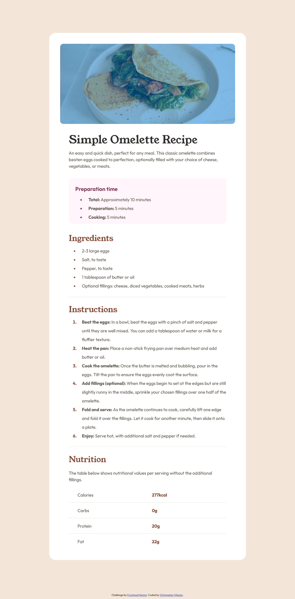

# Frontend Mentor - Recipe page solution

This is a solution to the [Recipe page challenge on Frontend Mentor](https://www.frontendmentor.io/challenges/recipe-page-KiTsR8QQKm). Frontend Mentor challenges help you improve your coding skills by building realistic projects. 

## Table of contents

- [Overview](#overview)
  - [The challenge](#the-challenge)
  - [Screenshot](#screenshot)
  - [Links](#links)
- [My process](#my-process)
  - [Built with](#built-with)
  - [What I learned](#what-i-learned)
  - [Continued development](#continued-development)
  - [Useful resources](#useful-resources)
- [Author](#author)
- [Acknowledgments](#acknowledgments)

## Overview

### Screenshot

### Links

- Solution URL: [https://www.frontendmentor.io/solutions/recipe-page-using-some-bem-and-css-grid-9VocmLY7XO](https://www.frontendmentor.io/solutions/recipe-page-using-some-bem-and-css-grid-9VocmLY7XO)
- Live Site URL: [https://frontend-recipepage.netlify.app/](https://frontend-recipepage.netlify.app/)

## My process

### Built with

- Semantic HTML5 markup
- CSS custom properties
- CSS Grid
- CSS BEM

### Useful resources

- [Perfect Pixel](https://www.example.com) - This helped me to compare my design with the one i wanted to achieve. So i could get as visually close as possible.

## Author

- Frontend Mentor - [@cemijares23](https://www.frontendmentor.io/profile/Cemijares23)
- Instagram - [@cmijares23](https://www.instagram.com/cmijares23/)
